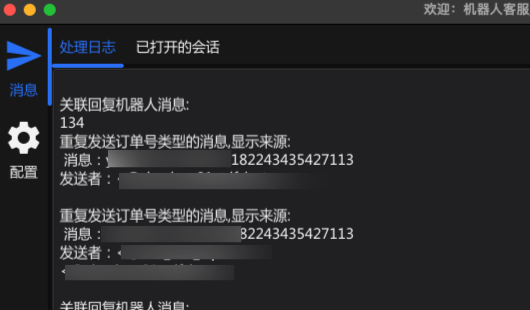
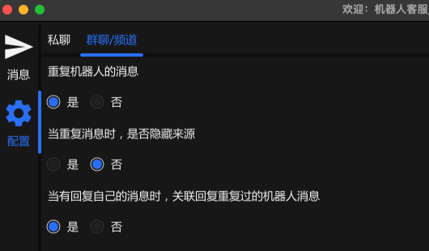

# <a href="https://github.com/midnightsong/telegram-assistant"></img></a> Telegram-Assistant
**Note**: 这个项目仍然处于早期开发中...

**本项目是基于[Fyne](https://github.com/fyne-io/fyne)和[GoTgProto](https://github.com/celestix/gotgproto)为基础二次开发的桌面应用程序**

### 实现功能：
#### 1、使用个人telegram账号登录，解决机器人无法互相之间读取消息的限制
#### 2、echo机器人消息
#### 3、实时修改配置项



有关 gotgproto的问题，你可以查看原始 [项目](https://github.com/celestix/gotgproto) 或关注原作者的频道:
- 发布频道: [](https://telegram.me/gotgproto)
- 群聊: [](https://telegram.me/gotgprotochat)

[](https://pkg.go.dev/github.com/celestix/gotgproto) [](http://perso.crans.org/besson/LICENSE.html)


## 安装
你可以通过`go get`命令来下载这个依赖库
```bash
go get github.com/midnightsong/telegram-assistant
```


## Contributing
Pull requests are welcome. For major changes, please open an issue first to discuss what you would like to change.

Please make sure to update the examples as appropriate.

## License
[](https://www.gnu.org/licenses/gpl-3.0.en.html)
<br>Licensed Under <a href="https://www.gnu.org/licenses/gpl-3.0.en.html">GNU General Public License v3</a>
